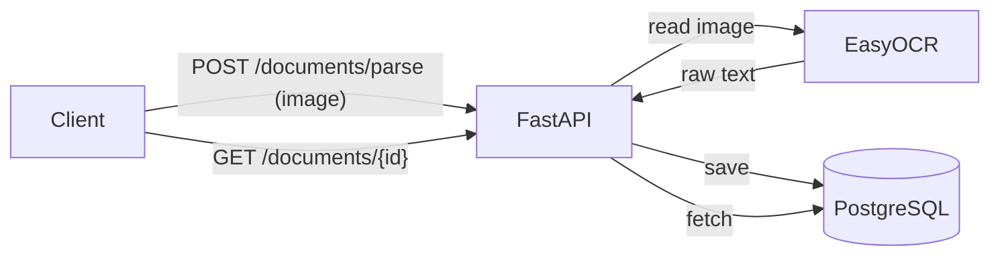

# DocuParse

OCR-сервис распознавания документов: принимает фото/скан документа (паспорт,
накладная, счёт), распознаёт текст через OCR и извлекает структурированные
поля в JSON. Имитирует кейс "фото документа -> данные в CRM".

## Status

- [x] Phase 1 - OCR parsing, save/get results
- [ ] Phase 2 - per-document-type field extraction (passport/invoice/receipt)
- [ ] Phase 3 - CI/CD + final docs

## Stack

Python 3.12, FastAPI, EasyOCR, Pillow, PostgreSQL (SQLAlchemy async), pytest,
Docker.

## How it works



## Running

```bash
cp .env.example .env
docker compose up --build
```

The app is available at `http://localhost:8000`. First OCR request is slow
since EasyOCR downloads and loads its EN+RU models; the models are cached in
a Docker volume so subsequent runs start fast.

## Endpoints

| Method | Path                | Description                                      |
| ------ | ------------------- | ------------------------------------------------- |
| POST   | `/documents/parse`  | Upload an image, run OCR, save and return the result |
| GET    | `/documents/{id}`   | Get a previously saved OCR result                |
| GET    | `/health`           | Health check                                     |

### Example

```bash
curl -X POST http://localhost:8000/documents/parse \
  -F "file=@invoice.png"
```

```json
{
  "id": 1,
  "filename": "invoice.png",
  "raw_text": "INVOICE No. 12345\nDate: 2026-01-10\nTotal: $250.00",
  "created_at": "2026-06-15T12:00:00Z"
}
```

```bash
curl http://localhost:8000/documents/1
```

## Tests

```bash
docker compose exec app pytest
```

## What I'd improve next

- Swap EasyOCR for a managed Vision API (e.g. Google Cloud Vision / AWS
  Textract) for better accuracy on real-world scans and a much smaller Docker
  image.
- Add PDF support (multi-page documents).
