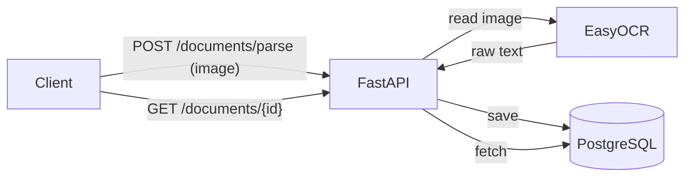

# DocuParse

OCR-сервис распознавания документов: принимает фото/скан документа (паспорт,
накладная, счёт), распознаёт текст через OCR и извлекает структурированные
поля в JSON. Имитирует кейс "фото документа -> данные в CRM".

## Status

- [x] Phase 1 - OCR parsing, save/get results
- [x] Phase 2 - per-document-type field extraction (passport/invoice/receipt)
- [ ] Phase 3 - CI/CD + final docs

## Stack

Python 3.12, FastAPI, EasyOCR, Pillow, PostgreSQL (SQLAlchemy async), pytest,
Docker.

## How it works



## Running

```bash
cp .env.example .env
docker compose up --build
```

The app is available at `http://localhost:8000`. First OCR request is slow
since EasyOCR downloads and loads its EN+RU models; the models are cached in
a Docker volume so subsequent runs start fast.

## Endpoints

| Method | Path                                  | Description                                           |
| ------ | ------------------------------------- | ------------------------------------------------------ |
| POST   | `/documents/parse`                    | Upload an image, run OCR, save and return raw text     |
| POST   | `/documents/parse?doc_type=<type>`    | Same, plus extract structured fields for `<type>`     |
| GET    | `/documents/{id}`                     | Get a previously saved OCR result                      |
| GET    | `/health`                             | Health check                                           |

`doc_type` is one of `passport`, `invoice`, `receipt`. Unknown values return `422`.

### Plain OCR

```bash
curl -X POST http://localhost:8000/documents/parse \
  -F "file=@invoice.png"
```

```json
{
  "id": 1,
  "filename": "invoice.png",
  "raw_text": "INVOICE No. 12345\nDate: 2026-01-10\nTotal: $250.00",
  "doc_type": null,
  "parsed_data": null,
  "created_at": "2026-06-15T12:00:00Z"
}
```

### Invoice (накладная / счёт)

```bash
curl -X POST "http://localhost:8000/documents/parse?doc_type=invoice" \
  -F "file=@invoice.png"
```

```json
{
  "id": 2,
  "filename": "invoice.png",
  "raw_text": "INVOICE\nInvoice No: INV-2026-001\nDate: 10.01.2026\nSupplier: Acme Corp\nTotal: 1500.00",
  "doc_type": "invoice",
  "parsed_data": {
    "number": "INV-2026-001",
    "date": "10.01.2026",
    "amount": "1500.00",
    "supplier": "Acme Corp"
  },
  "created_at": "2026-06-15T12:01:00Z"
}
```

### Passport

```bash
curl -X POST "http://localhost:8000/documents/parse?doc_type=passport" \
  -F "file=@passport.png"
```

```json
{
  "id": 3,
  "filename": "passport.png",
  "raw_text": "PASSPORT\nName: John Smith\nDate of Birth: 01.01.1990\nPassport No: AB1234567",
  "doc_type": "passport",
  "parsed_data": {
    "full_name": "John Smith",
    "passport_number": "AB1234567",
    "birth_date": "01.01.1990"
  },
  "created_at": "2026-06-15T12:02:00Z"
}
```

### Receipt (чек)

```bash
curl -X POST "http://localhost:8000/documents/parse?doc_type=receipt" \
  -F "file=@receipt.png"
```

```json
{
  "id": 4,
  "filename": "receipt.png",
  "raw_text": "RECEIPT\nStore: SuperMart\nDate: 14.06.2026\nTotal: 45.67",
  "doc_type": "receipt",
  "parsed_data": {
    "store": "SuperMart",
    "date": "14.06.2026",
    "total": "45.67"
  },
  "created_at": "2026-06-15T12:03:00Z"
}
```

### Get a saved result

```bash
curl http://localhost:8000/documents/1
```

## Tests

```bash
docker compose exec app pytest
```

## What I'd improve next

- Swap EasyOCR for a managed Vision API (e.g. Google Cloud Vision / AWS
  Textract) for better accuracy on real-world scans and a much smaller Docker
  image.
- Add PDF support (multi-page documents).
